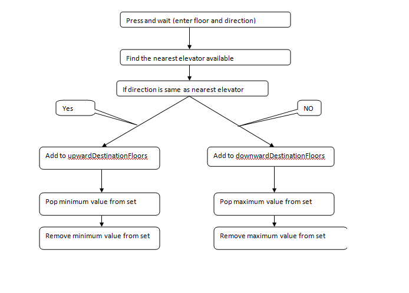

Elevator Simulator using  Java language
---------------------------------------

Interface used -
-----------------

Status(); - to get the set of elevators with ID , current floor and destination floor set 
ID -1704856573 current floor -4, Upward Destination floor - [6, 7, 8] , Downward Destination floor - [5]

pickup(Floor ID, Direction )
pickUp(6,"+");

step();
to perform the calculations

update(elevatorId: ElevatorId, currentFloor: Floor, goalFloor: Floor) : Elevator
Enter and request scenario 

Datastructure used - Treeset
-------------------------------------------
Each elevator has 2 Treeset datastructure (to over come FCFS problem )
1. upwardDestinationFloors - > to store floor request of same direction 
2. downwardDestinationFloors ->  to store floor request of opposite  direction 

upwardDestinationFloors -
1. Values will  be in sorted order (ascending)
2. Duplicates are not allowed 
3.always take the minimum value out from the set using first() methid.

downwardDestinationFloors -
1. Values will  be in sorted order (ascending)
2. Duplicates are not allowed 
3.always take the maximum value out from the set using last() method.

Algorithm used- 
----------------------------------------------

Events of the elevator(Methods) : GOINGUP, GOINGDOWN, HOLD 
States of the elevator(Data) : OCCUOPIED, EMPTY

Elevator movements are driven by 2 activities -
1. Press and wait at the floor with direction (PAW)
2. Enter and Request in the elevator (EAR)

Press and wait has 2 parameter - floor number and direction -> pickup( Floor number , direction (+/-))
Direction can be the same as the current lift or in opposite direction 
If it is same direction add to upwardDestinationFloors and for opposite direction add to downwardDestinationFloors

EAR can be any of the 2 types depending upon the users behavior.
1.) Normal - same direction as current elevator direction add to upwardDestinationFloors
2.) Opposite - opposite direction as current elevator direction add to downwardDestinationFloors

